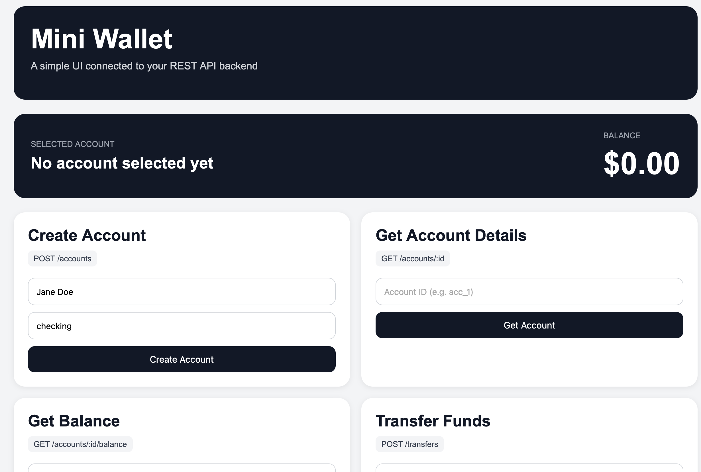
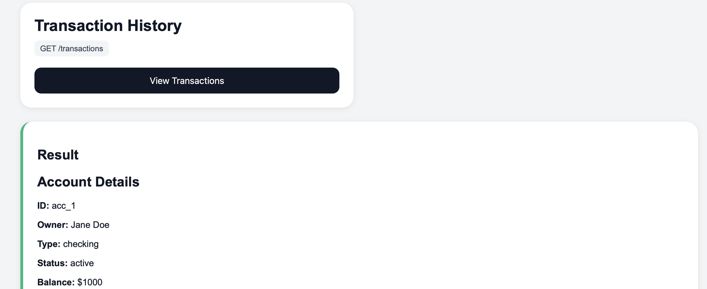
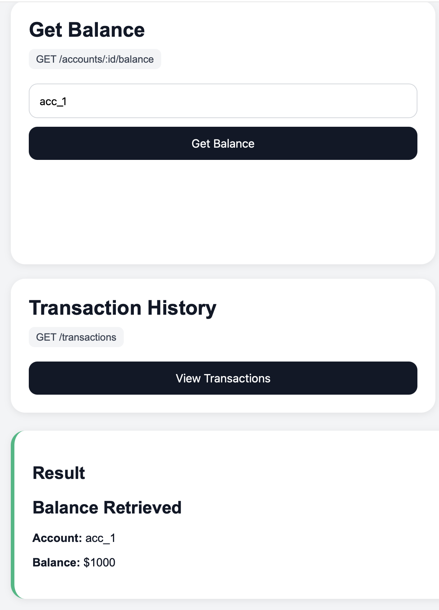
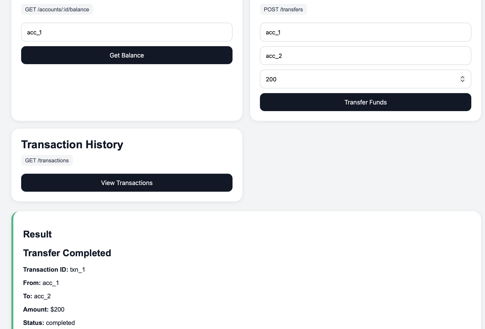
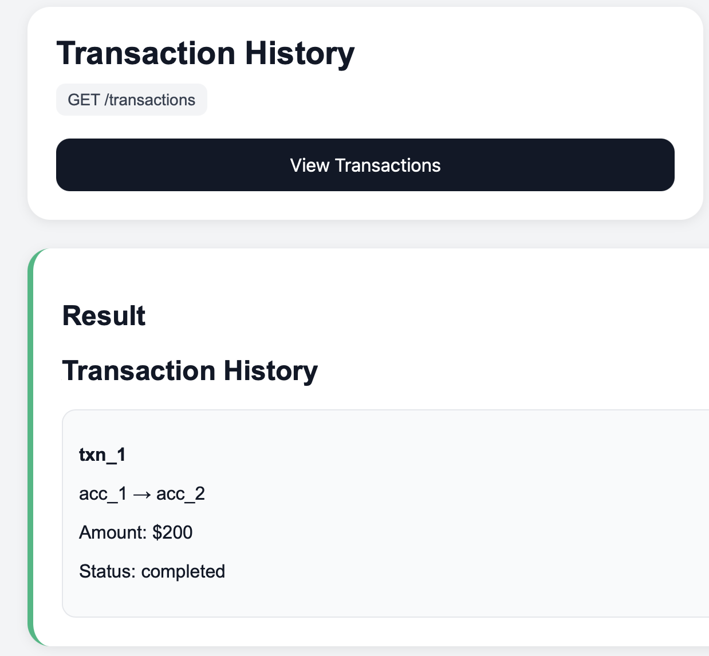

# Mini Wallet API

Mini Wallet API is a small fintech-style REST API and browser demo that simulates common wallet workflows: creating accounts, checking balances, transferring funds, and viewing transaction history.

I built this project to practice the kind of API walkthroughs, integration troubleshooting, and customer-facing documentation that come up often in Solutions Engineer roles.

## What This Project Demonstrates

- REST API design with Node.js and Express
- API key authentication using request headers
- JSON request and response workflows
- Input validation and error handling
- A simple browser UI for live demos
- Clear endpoint documentation for technical audiences
- A customer-style flow from account creation to transfer confirmation

## Business Use Case

This API models a simplified digital wallet platform. A customer or partner application can:

1. Create wallet accounts for users.
2. Retrieve account details.
3. Check balances.
4. Transfer funds between accounts.
5. Review transaction history.

That makes it useful as a demo project for explaining API integrations, request/response behavior, authentication, and common failure cases.

## Tech Stack

- Node.js
- Express
- HTML, CSS, and JavaScript
- REST APIs
- JSON

## Getting Started

### 1. Install dependencies

```bash
npm install
```

### 2. Create an environment file

Create a `.env` file in the project root:

```bash
API_KEY=demo-key-123
PORT=3000
```

### 3. Start the API

```bash
npm start
```

For local development with automatic restarts:

```bash
npm run dev
```

The API will run at:

```text
http://localhost:3000
```

## Authentication

Protected endpoints require an API key in the `x-api-key` header.

```text
x-api-key: demo-key-123
```

If the key is missing or incorrect, the API returns:

```json
{
  "error": {
    "code": "UNAUTHORIZED",
    "message": "Missing or invalid API key.",
    "requestId": "req_2f4f2f92-7d6d-4e88-9a2f-0a55d5a5a111"
  }
}
```

## Error Format

Errors use a consistent response shape so developers can troubleshoot failed requests more easily.

```json
{
  "error": {
    "code": "INSUFFICIENT_FUNDS",
    "message": "The source account does not have enough balance.",
    "requestId": "req_2f4f2f92-7d6d-4e88-9a2f-0a55d5a5a111"
  }
}
```

## Postman Collection

You can test the API using the shared Postman collection:

[Mini Wallet API Postman Collection](https://aac-1999.postman.co/workspace/Unit~72b83eca-0890-4b60-854b-fa3786100897/collection/25753790-c935a4f9-8a9b-415a-b30c-60ec0493edf9?action=share&source=copy-link&creator=25753790)

The collection is useful for walking through the API like a customer integration demo:

1. Create accounts.
2. Retrieve account details.
3. Check balances.
4. Transfer funds.
5. View transaction history.
6. Test error cases like missing authentication or insufficient funds.

## Example API Flow

### Create Account

```http
POST /accounts
```

Request:

```json
{
  "owner": "Jane Doe",
  "type": "checking"
}
```

Response:

```json
{
  "id": "acc_1",
  "owner": "Jane Doe",
  "type": "checking",
  "balance": 1000,
  "currency": "USD",
  "status": "active"
}
```

### Get Account Details

```http
GET /accounts/acc_1
```

### Get Account Balance

```http
GET /accounts/acc_1/balance
```

### Transfer Funds

```http
POST /transfers
```

Request:

```json
{
  "fromAccountId": "acc_1",
  "toAccountId": "acc_2",
  "amount": 200
}
```

Response:

```json
{
  "id": "txn_1",
  "fromAccountId": "acc_1",
  "toAccountId": "acc_2",
  "amount": 200,
  "currency": "USD",
  "status": "completed",
  "referenceId": "ref_7e6d9822-44d1-45fc-90c2-c1eb24f2175f",
  "createdAt": "2026-05-26T18:30:00.000Z"
}
```

### View Transaction History

```http
GET /transactions
```

## Demo Walkthrough

A simple demo flow for this project:

1. Start the server with `npm start`.
2. Open `http://localhost:3000`.
3. Create two accounts.
4. Check the balance for the first account.
5. Transfer funds from the first account to the second account.
6. View transaction history.
7. Try an invalid request, such as a transfer with insufficient funds, to show error handling.

## Project Structure

```text
src/
  app.js                  Express app setup and route wiring
  server.js               Server startup
  data/store.js           In-memory account and transaction store
  middleware/auth.js      API key authentication
  middleware/errorHandler.js
  routes/accounts.js      Account creation, lookup, and balance routes
  routes/transfers.js     Transfer route and validation
  routes/transactions.js  Transaction history route
  utils/errors.js         Shared structured error response helper
```

## UI Screenshots

### Mini Wallet Dashboard



### Account Created



### Balance Lookup



### Transfer Funds



### Transaction History



## What I Learned

Through this project I practiced:

- Designing REST endpoints around a realistic workflow
- Explaining API behavior through clear examples
- Handling authentication with request headers
- Validating request data before changing application state
- Returning useful status codes and error messages
- Building a small UI to make an API easier to demo
- Thinking about developer experience from a customer perspective

## Future Improvements

- Export the Postman collection into the repo
- Add OpenAPI/Swagger documentation
- Add automated API tests
- Persist data with a database instead of in-memory arrays
- Add pagination and filters for transaction history
